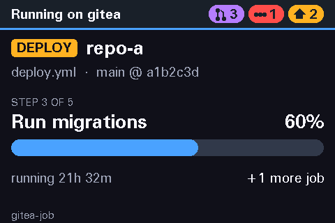

# DeskWatch

DeskWatch is a desk status panel built around an ESP32-S3. When idle it rotates through server stats, open pull
requests and pipeline status. When a CI job runs it switches to live progress, shows a red alert on failure
(cleared with a button) and a short green flash on success. Home Assistant or any script can raise alerts on it.



## How it fits together

- **Bridge** (Rust, runs on a Linux or Windows machine that stays on): collects server stats, receives Gitea webhooks, polls GitHub,
  GitHub Enterprise, Azure DevOps and Prometheus, takes alerts from Home Assistant, decides what the panel should show and
  publishes it over MQTT.
- **Panel**: a deliberately dumb MQTT client with a touch screen (planned: an ESP32-S3 SuperMini with a 4" ST7796S
  display) that draws whatever page the bridge sends. Its drawing code, the `ui/` crate, is done and runs today in
  a desktop simulator; the firmware is not part of 0.9.
- **MQTT** (Mosquitto) sits between the two. The contract is [docs/mqtt-schema.md](docs/mqtt-schema.md), with JSON
  samples in [docs/schema/](docs/schema/) that both sides are tested against.

## What is in 0.9

| Part | State |
|---|---|
| Bridge with idle rotation, screen priority, button handling | Done |
| Sources: Gitea, GitHub and GitHub Enterprise, Prometheus (node_exporter, cAdvisor), local `/proc` stats (Linux only) | Done |
| Alerts from Home Assistant and scripts, with blueprints | Done |
| Mosquitto logins, ACL example, TLS | Done |
| Panel UI (`ui/`) and desktop simulator (`sim/`) | Done |
| Linux x86_64 release binary, systemd unit, install guide ([docs/install.md](docs/install.md)) | Done |
| Source: Azure DevOps Services (pipeline runs, approvals, PRs; [docs/azure-devops.md](docs/azure-devops.md)) | Done |
| Windows x86_64 release zip (bridge and simulator), install and test guide | Done, see [docs/windows.md](docs/windows.md) |

## What is not in 0.9

- **The firmware.** The real panel waits for the display to arrive. 1.0 is reserved for the first release with working firmware on the real screen. Until then the simulator draws exactly what
  the panel will, and the schema is the contract the firmware will implement. Over-the-air updates come last.
- **CI runner and agent pool status** (Gitea runners, Azure DevOps agent pools) are planned after 1.0.
- **TLS on the webhook listener.** Gitea talks plain HTTP to the bridge; put a reverse proxy in front if the path
  crosses an untrusted network.
- **Release binaries for macOS and 32-bit ARM.** Release binaries are x86_64 for Linux and Windows, and aarch64 for
  Linux (64-bit Raspberry Pi OS). Build from source for anything else; macOS is not covered, contributions are welcome.

## Install

DeskWatch supports **Linux and Windows**, plus the Raspberry Pi (64-bit Linux).

- **Linux:** [docs/install.md](docs/install.md) walks through the whole setup on a systemd server (written for
  Debian 12 or newer): download or build the binary, config, systemd unit with credentials, Mosquitto logins, then
  each source and Home Assistant.
- **Docker:** [docs/docker.md](docs/docker.md) builds a small non-root image of the bridge and has a Compose
  example with config and secrets mounted read-only. Multi-arch (amd64 and arm64) in CI; nothing is published to a registry.
- **Raspberry Pi:** [docs/raspberry-pi.md](docs/raspberry-pi.md) covers 64-bit Raspberry Pi OS with the aarch64 release
  binary and systemd, or Docker. A Pi is also a fine always-on machine for the demo.
- **Windows:** [docs/windows.md](docs/windows.md) covers the release zip, Mosquitto, trying the demo and the
  simulator, a config and secrets, running the bridge as a service, and what differs (the local stats page needs
  Linux's `/proc` for now). The source, Mosquitto and Home Assistant steps in the Linux guide apply on Windows too.
- **macOS** is not covered; contributions are welcome.

A short overview of the sources is below.

## Running the bridge by hand

Needs a stable Rust toolchain (1.88 or newer) and a Mosquitto broker.

```sh
cargo run -p deskwatch-bridge -- bridge/config.example.toml
mosquitto_sub -t 'deskpanel/#' -v   # in another terminal
```

The config path can also come from `DESKWATCH_CONFIG`; the default is `/etc/deskwatch/bridge.toml`
(`%ProgramData%\DeskWatch\bridge.toml` on Windows). On a Linux server run it as a service, see [deploy/deskwatch-bridge.service](deploy/deskwatch-bridge.service). The example config
has a Gitea block switched on; remove it if you have no Gitea.

Secrets never go in the config. Keys ending in `_file` name a credential: a plain name such as `gitea-token`
is read from `$CREDENTIALS_DIRECTORY`, which systemd fills from the unit's `LoadCredential=` lines (on Windows it is
`%ProgramData%\DeskWatch\credentials`); an absolute path is read directly, which is handy when running by hand. The MQTT password can also come from
`DESKWATCH_MQTT_PASSWORD`.

## Sources

Each source is a `[[source.<type>]]` block in the config and runs as its own task; a source that cannot log in or
connect shows as a `warn` badge on the panel. Setup for each is in [docs/install.md](docs/install.md#5-sources) (Azure DevOps in more detail in
[docs/azure-devops.md](docs/azure-devops.md)).

| Source | How it gets data | What it adds |
|---|---|---|
| `gitea` | Webhooks for instant job start and end, polling for step progress and open PRs | Running job takes over the screen, red alert on failure, green flash on success, PR badge, pipelines page |
| `github` | Polling with ETags (github.com, GitHub Enterprise Server, GHE.com) | The same as Gitea |
| `azure_devops` | Polling with a read-only token (Azure DevOps Services); setup in [docs/azure-devops.md](docs/azure-devops.md) | Pipeline runs with stage and task (Terraform plan and apply), a notice when a deploy waits for an approval, PR count; quiet unless you set `interrupt` |
| `prometheus` | HTTP API (node_exporter, cAdvisor) | A `stats:<host>` page per machine, a `containers` page of what stopped, a `server` badge |
| built-in `stats` | `/proc` and `/sys` of the bridge machine (Linux; on Windows it shows only the machine name) | The home page, always available |

`interrupt` decides which repositories may take over the screen. Runs from other repositories still show on the
pipelines page, and their failures still count in the red header badge until a green run of the same pipeline
replaces them. `alias` gives repositories short labels on the panel.

**Button:** a short press dismisses an alert or notice, or shows the next page during rotation. A long press
pins the current rotation page, or shows the next running job when several run at once.

## Alerts from Home Assistant and scripts

Anything that can publish MQTT can raise an alert on `deskpanel/alert`:

```sh
mosquitto_pub -t deskpanel/alert -m '{"v":2,"id":"freezer","severity":"warning","title":"Freezer door","message":"Open for 5 min","source":"homeassistant"}'
mosquitto_pub -t deskpanel/alert -m '{"v":2,"id":"freezer","clear":true}'
```

- `info` flashes a notice for 5 seconds and is listed on the `alerts` page for 30 minutes (or `ttl_s`).
- `warning` shows an amber screen until the button is pressed or for 10 minutes.
- `critical` shows a red screen above running jobs until the button is pressed.

After the button, warnings and criticals stay in the `home` header badge and on the `alerts` page until they
are cleared with the same `id` or their `ttl_s` runs out. Add `page = "alerts"` to `[[rotation]]` to show the
list. The `[alerts]` config table can turn the topic off, cap the number of alerts, and limit which ids may be
critical. Full field list in [docs/mqtt-schema.md](docs/mqtt-schema.md).

The broker should not let alert publishers write any other `deskpanel` topic. For Home Assistant, import the
script blueprints in [`homeassistant/blueprints/script`](homeassistant/blueprints/script) and follow
[docs/home-assistant.md](docs/home-assistant.md): people then build alerts in the HA UI with a title, message and
severity, and clear them by id.

## Broker logins

Give the bridge, the panel and Home Assistant each their own Mosquitto login limited to their own topics:
[docs/mosquitto.md](docs/mosquitto.md) (written for a Linux broker; Windows notes in [docs/windows.md](docs/windows.md#2-mosquitto)) explains how to find the clients using your broker before turning
anonymous access off, and [deploy/mosquitto](deploy/mosquitto) has an example config and ACL. The bridge takes
`username`, `password_file` and optional `tls` settings in `[mqtt]`, see `bridge/config.example.toml`.

## Demo mode

`--demo` plays a loop of fake data of a little over two minutes, so you can watch every page in the simulator
without Gitea or Home Assistant: stats, open PRs, pipelines and alerts pages, notices, a running deploy with a
second job, a failure cleared by the button, a green success flash, and an amber and a red home alert. No
sources run; only `[mqtt]` and `[alerts]` from the config are used, and the config file is optional.

```sh
cargo run -p deskwatch-bridge -- --demo    # broker on localhost, or pass a config file
cargo run -p deskwatch-sim -- --host localhost
```

Pressing the simulator's button during the demo works as on the real panel.

## Panel UI and simulator

The panel's drawing code lives in `ui/` (`deskwatch-ui`), a `no_std` crate that parses the MQTT payloads and
draws the six page templates (stats, job, alert, list, number, notice) plus the header badges and footer on a
480x320 landscape screen. The firmware will use it unchanged; until the screen arrives, `sim/`
(`deskwatch-sim`) draws the same pixels in a desktop window.

The simulator needs SDL2 (`sudo apt install libsdl2-dev` on Debian or Ubuntu). On Windows SDL2 is built in, see
[docs/windows.md](docs/windows.md).

```sh
# Live: subscribe to the bridge's topics; click is the button (hold for a long press)
cargo run -p deskwatch-sim -- --host localhost

# Flip through the example payloads, no broker needed
cargo run -p deskwatch-sim -- preview ui/testdata/screens --badges ui/testdata/badges/default.json

# Headless PNG of one payload (also builds without SDL: --no-default-features)
cargo run -p deskwatch-sim -- render ui/testdata/screens/job_deploy.json -o job.png
```

You can also drive the live window by hand, before the bridge produces a page:

```sh
mosquitto_pub -r -t deskpanel/screen -f ui/testdata/screens/alert_failed.json
```

`ui/testdata/screens/` has one example payload per template and edge case. `cargo test -p deskwatch-ui`
renders each one and compares it with the approved image in `ui/tests/snapshots/`; after an intended layout
change, re-approve with `UPDATE_SNAPSHOTS=1 cargo test -p deskwatch-ui` and review the PNG diff in the PR.

## License

Licensed under either of

- Apache License, Version 2.0 ([LICENSE-APACHE](LICENSE-APACHE))
- MIT license ([LICENSE-MIT](LICENSE-MIT))

at your option.
